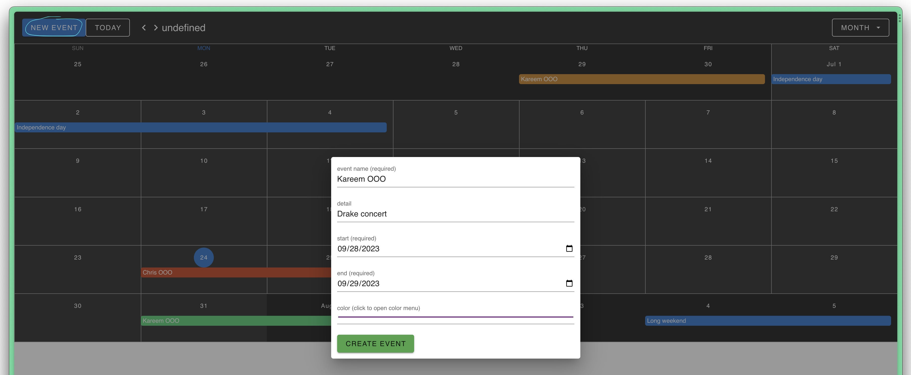

# Vue Calendar

## Description

I created this calendar app for my team members/coworkers to use. I took on this project so that my team would no longer have to worry about having to use a google calendar spread sheet and repeatedly update the spread sheet formula when a new calendar year starts (screenshot below).

**Calendar previously used at work** 

This vue calendar is a simple and customizable calendar component built with Vue.js. It allows my team to view, create, and manage events and coordinate out time off efficiently.

Lastly, I used google firebase for hosting and database useage to keep things quick and simple.

## Features

- View monthly, weekly, or daily calendars
- Add, edit, and delete events
- Drag-and-drop events to reschedule
- Customizable styles and themes

## My Team Calendar

#

**Overall Calendar** 

**Creating an event on the Calendar** 

**Edit or Delete Calendar event** 

## Tech Stack

#

